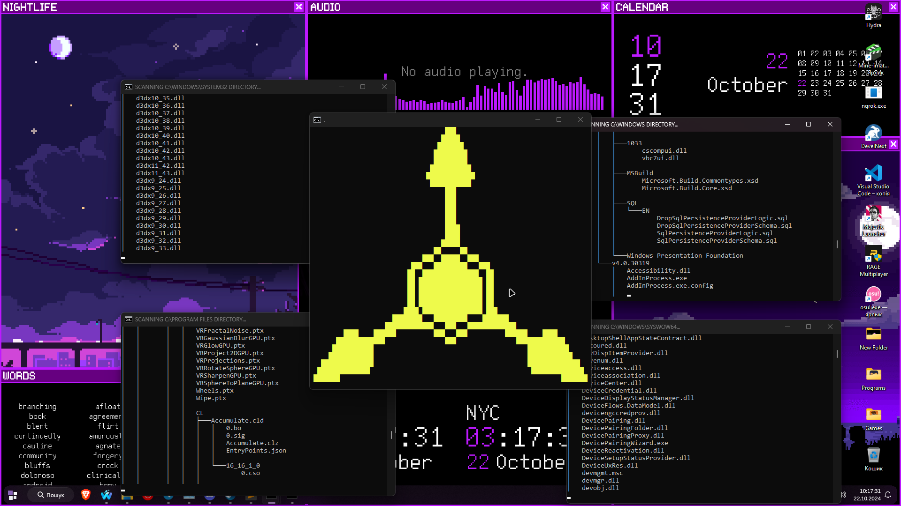
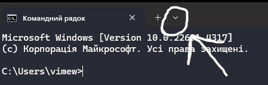
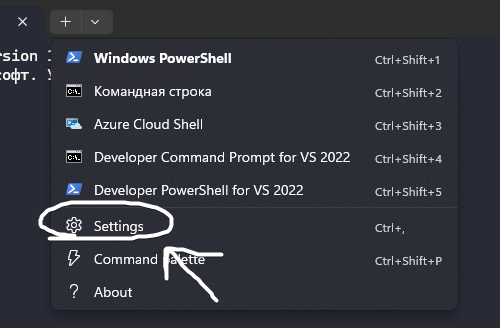
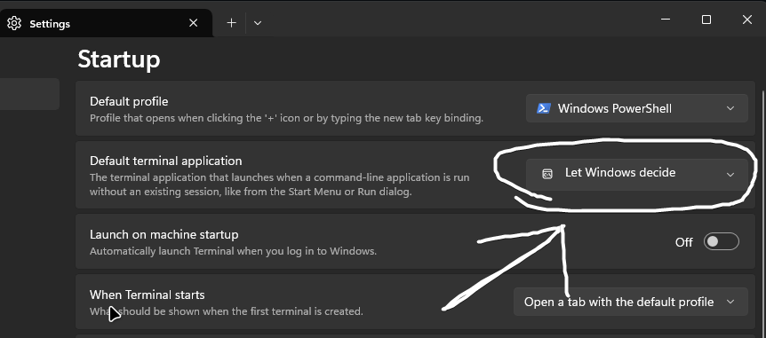
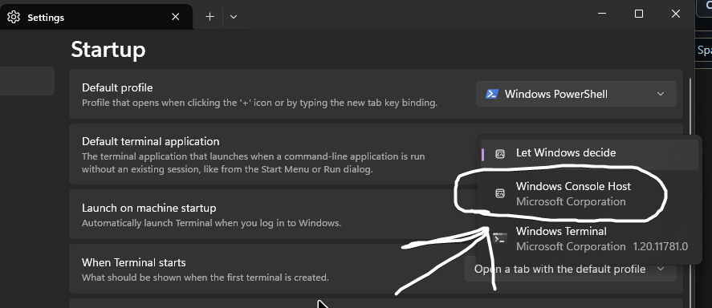
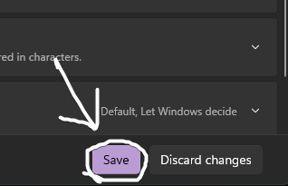

# Dilki Virus

  

## 📥 Download Options

### Latest Stable Release

### Pre-Release Version

  
  
This application may cause system lag. Use at your own risk!

--------------------------------------------------------------------------------
## Simple Installation (Windows 11)
1. [Download Compiled code](https://github.com/noxygalaxy/cyn-fake-virus/releases/download/v1.0.0/cyn-fake-virus.exe)  
2. Open cmd.exe (type it in search or in Win+R menu)  
3. Follow screenshots:  
 
 
 
 
 
------------------------------------------------------------------------------------

## Installation
1. Install [Python 3.X](https://www.python.org/) if you haven't already.
2. Install source code and run `install.bat` ( it's gonna download required libraries! )
3. After console closed, run `RunMe.bat` ( it's gonna start program!)  
   it should work! if it doesnt send issue into [Issues](https://github.com/)  
(After closing it gonna still have CMDs opened, thats completely fine!)

## Licened By RandomCatUser 
 For More Visit [Hello](https://randomcatuser.github.io/hello) 
